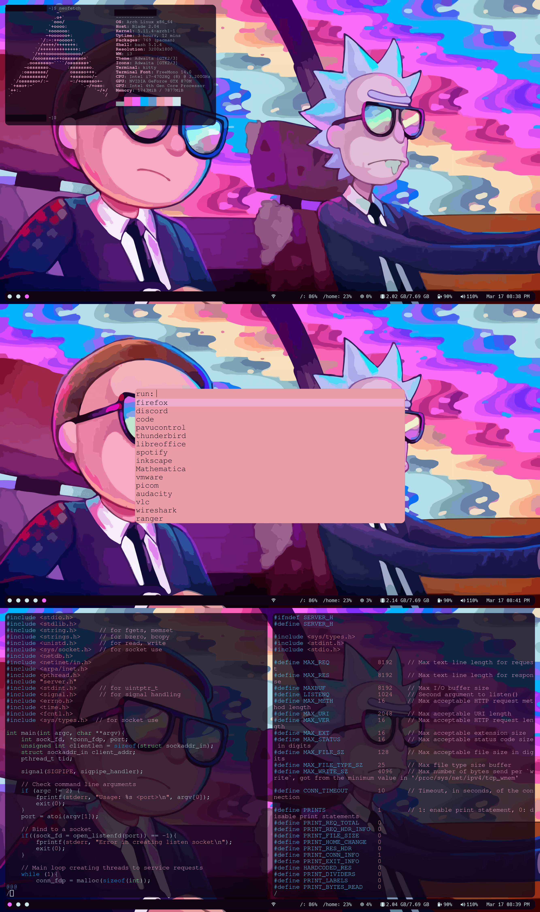
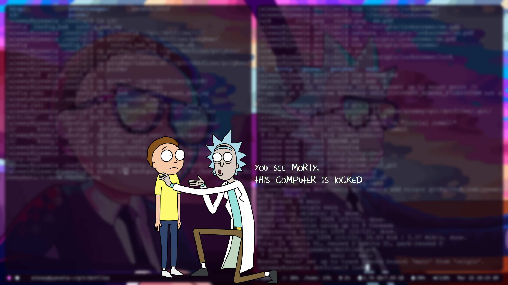

# Dotfiles
* I didn't write any of these files from scratch, I took other people's dots and messed with them until I got the look I was going for. As a result, the code is most likely not portable and very messy, I apologize for any inconvenience.
* I also want to mention my screen is high DPI for a smaller display so I had to do some size/DPI modifications in some of the configs to get stuff looking normal in real life.

